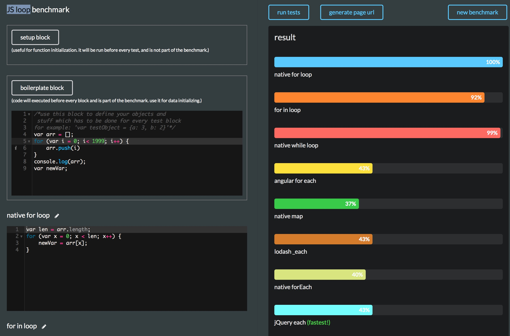
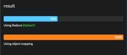
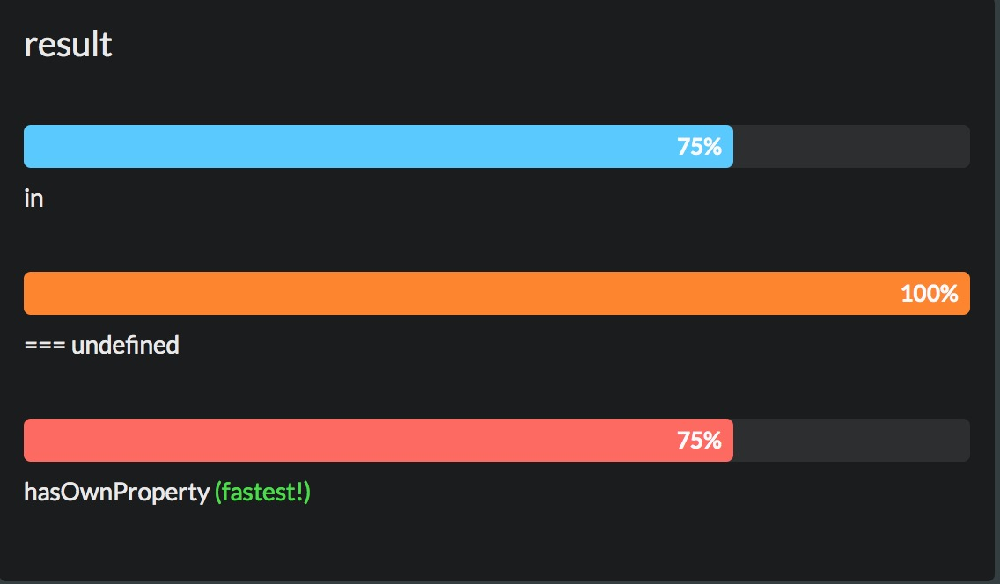
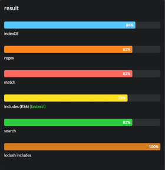
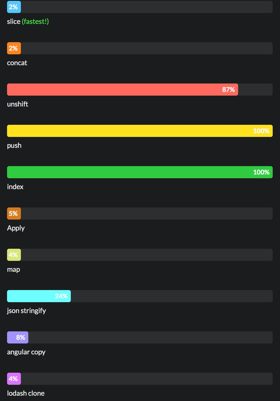
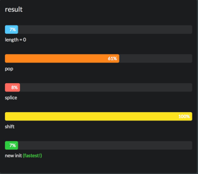
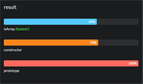

# js-best-practise
The result is based on [jsben](http://jsben.ch/browse).

During the test, I got different result in different result, in one benchmark. Some times the chart even has some error.

worng result


##### Array grouping

use reduce [link](http://jsben.ch/hVhEV)

```js
var groupable = [];
var keyPropertyName = 'key';
var valuePropertyName = 'value';

var keys = ["Lord", "Of", "The", "Rings"];
for (var i = 0; i < 1000; i++) {
    var keyIndex = Math.round(Math.random() * 4);
    var obj = {};

    obj[keyPropertyName] = keys[keyIndex];
    obj[valuePropertyName] = i;

    groupable.push(obj);
}

var groups = {};

groupable.reduce(function (obj, item) {
    (obj[item[keyPropertyName]] = obj[item[keyPropertyName]] || []).push(item);
    return obj;
}, groups);

var result = Object.keys(groups) === 4;

```


##### check object key
use in or hasOwnProperty [link](http://jsben.ch/WqlIl)

```js
var testObj = {a: 28, b: 82, c: "hello", d: 983, e: 'lara', o: "key", f: '82828', g: 8};

var result;
if ("key" in testObj) {
    result = true;
}

var result;
if (testObj.hasOwnProperty("key")) {
    result = true;
}

```


##### is string in string. indexOf vs. regex vs. match vs. includes vs. search vs. lodash includes

use includes (ES6) [link](http://jsben.ch/RVYk7)

```js
var str = "nasd.n.kasdkskdnfkjsdfkjhsdfiuhsdfiusadfiuhsdfiöhsdifhsäodfjiosdfisdfsdfnosdfiosdf89sdfs98pdfzp98sdf98psfzp8sfzp8sfzp89szfp8snasd.n.kasdkskdnfkjsdfkjhsdfiuhsdfiusadfiuhsdfiöhsdifhsäodfjiosdfisdfsdfnosdfiosdf89sdfs98pdfzp98sdf98psfzp8sfzp8sfzp89szfp8snasd.n.kasdkskdnfkjsdfkjhsdfiuhsdfiusadfiuhsdfiöhsdifhsäodfjiosdfisdfsdfnosdfiosdf89sdfs98pdfzp98sdf98psfzp8sfzp8sfzp89szfp8snasd.hellon.kasdkskdnfkjsdfkjhsdfiuhsdfiusadfiuhsdfiöhsdifhsäodfjiosdfisdfsdfnosdfiosdf89sdfs98pdfzp98sdf98psfzp8sfzp8sfzp89szfp8s";
var needle = "hello";
var needleRegex = /hello/;

var test = str.includes(needle);  
```


##### copy / clone Array

use slice or contanc [link](http://jsben.ch/wQ9RU)

```js
var testArray = [29, 27, 28, 838, 22, 2882, 2, 93, 84, 74, 7, 933, 3754, 3874, 22838, 38464, 3837, 82424, 2927, 2625, 63, 27, 28, 838, 22, 2882, 2, 93, 84, 74, 7, 933, 3754, 3874, 22838, 38464, 3837, 82424, 2927, 2625, 63, 27, 28, 838, 22, 2882, 2, 93, 84, 74, 7, 933, 3754, 3874, 22838, 38464, 3837, 82424, 2927, 2625, 63, 27, 28, 838, 22, 2882, 2, 93, 84, 74, 7, 933, 3754, 3874, 22838, 38464, 3837, 82424, 2927, 2625, 63];

var obj2 = testArray.slice();
var obj2 = [].concat(testArray);

```


##### empty an array (length, pop, splice, shift)

use length = 0 or new init [link](http://jsben.ch/hyj65)

```js
var testArray = [83, 93, 27, 29, 2828, 234, 23, 56, 32, 56, 67, 77, 32, 45, 93, 17, 28, 83, 62, 99, 36, 28, 93, 27, 29, 2828, 234, 23, 56, 32, 56, 67, 77, 32, 45, 93, 17, 28, 83, 62, 99, 36, 28, 93, 27, 29, 2828, 234, 23, 56, 32, 56, 67, 77, 32, 45, 93, 17, 28, 83, 62, 99, 36, 28, 93, 27, 29, 2828, 234, 23, 56, 32, 56, 67, 77, 32, 45, 93, 17, 28, 83, 62, 99, 36, 28, 93, 27, 29, 2828, 234, 23, 56, 32, 56, 67, 77, 32, 45, 93, 17, 28, 83, 62, 99, 36, 28, 93, 27, 29, 2828, 234, 23, 56, 32, 56, 67, 77, 32, 45, 93, 17, 28, 83, 62, 99, 36, 28, 93, 27, 29, 2828, 234, 23, 56, 32, 56, 67, 77, 32, 45, 93, 17, 28, 83, 62, 99, 36, 28, 93, 27, 29, 2828, 234, 23, 56, 32, 56, 67, 77, 32, 45, 93, 17, 28, 83, 62, 99, 36, 28, 93, 27, 29, 2828, 234, 23, 56, 32, 56, 67, 77, 32, 45, 93, 17, 28, 83, 62, 99, 36, 28, 93, 27, 29, 2828, 234, 23, 56, 32, 56, 67, 77, 32, 45, 93, 17, 28, 83, 62, 99, 36, 28];

testArray.length = 0;

testArray = [];

```



##### check if var is array

use isArray or cunstructor  [link](http://jsben.ch/wQ9RU)

```js
var testArray = [29, 29 , 28, 39, 38, 2828, 28, 993, 3];
var testVar = "hello";

var result;

if (Array.isArray(testArray)) result = true;
if (Array.isArray(testVar)) result = true;

if (testArray.constructor === Array) result = true;
if (testVar.constructor === Array) result = true;
```


##### 

use [link](http://jsben.ch/wQ9RU)

```js

```


##### 

use [link](http://jsben.ch/wQ9RU)

```js

```

